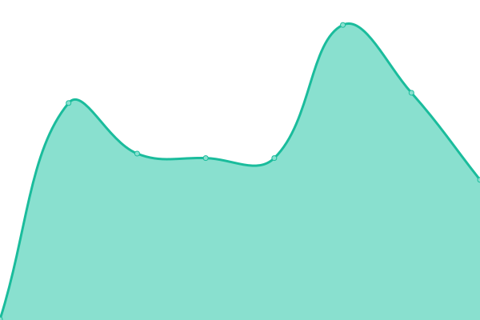
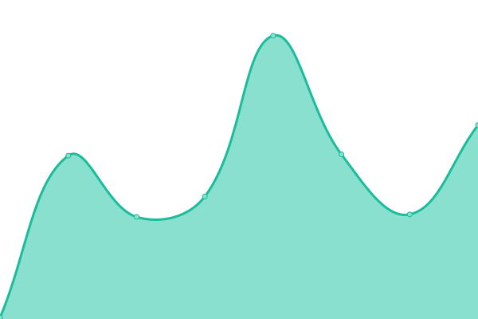

# [📈 Live Status](https://status.weweb.io): <!--live status--> **🟩 All systems operational**

This repository contains the open-source uptime monitor and status page for [weweb-team](https://status.weweb.io), powered by [Upptime](https://github.com/upptime/upptime).

With [Upptime](https://upptime.js.org), you can get your own unlimited and free uptime monitor and status page, powered entirely by a GitHub repository. We use [Issues](https://github.com/weweb-team/status-page/issues) as incident reports, [Actions](https://github.com/weweb-team/status-page/actions) as uptime monitors, and [Pages](https://status.weweb.io) for the status page.

<!--start: status pages-->
<!-- This summary is generated by Upptime (https://github.com/upptime/upptime) -->
<!-- Do not edit this manually, your changes will be overwritten -->
<!-- prettier-ignore -->
| URL | Status | History | Response Time | Uptime |
| --- | ------ | ------- | ------------- | ------ |
|  [WeWeb Dashboard](https://dashboard.weweb.io/) | 🟩 Up | [we-web-dashboard.yml](https://github.com/weweb-team/status-page/commits/HEAD/history/we-web-dashboard.yml) | 

 442ms
     
 | 

<a href="https://status.weweb.io/history/we-web-dashboard">100.00%</a>
    

|  [WeWeb Editor](https://editor.weweb.io/) | 🟩 Up | [we-web-editor.yml](https://github.com/weweb-team/status-page/commits/HEAD/history/we-web-editor.yml) | 

 436ms
     
 | 

<a href="https://status.weweb.io/history/we-web-editor">100.00%</a>
    

|  [WeWeb Published Websites](https://75728db6-a4ba-4b6b-a542-5db07b10642e.weweb-preview.io/) | 🟩 Up | [we-web-published-websites.yml](https://github.com/weweb-team/status-page/commits/HEAD/history/we-web-published-websites.yml) | 

 439ms
     
 | 

<a href="https://status.weweb.io/history/we-web-published-websites">100.00%</a>
    

|  [Xano (third-party)](https://app.xano.com/) | 🟩 Up | [xano-third-party.yml](https://github.com/weweb-team/status-page/commits/HEAD/history/xano-third-party.yml) | 

 360ms
     
 | 

<a href="https://status.weweb.io/history/xano-third-party">100.00%</a>
    

|  [Supabase (third-party)](https://supabase.com/dashboard/org) | 🟩 Up | [supabase-third-party.yml](https://github.com/weweb-team/status-page/commits/HEAD/history/supabase-third-party.yml) | 

 83ms
     
 | 

<a href="https://status.weweb.io/history/supabase-third-party">100.00%</a>
    

<!--end: status pages-->

[**Visit our status website →**](https://status.weweb.io)

## 📄 License

- Powered by: [Upptime](https://github.com/upptime/upptime)
- Code: [MIT](./LICENSE) © [Anand Chowdhary](https://anandchowdhary.com), supported by [Pabio](https://pabio.com)
- Data in the `./history` directory: [Open Database License](https://opendatacommons.org/licenses/odbl/1-0/)
